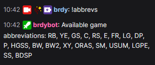
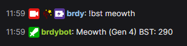
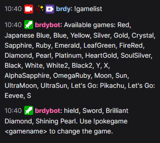
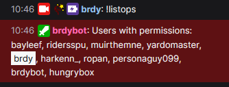
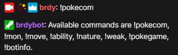
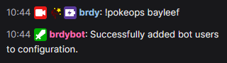

# brdybot
This is a bot adapted from [chatbot-python-sample](https://github.com/twitchdev/chatbot-python-sample) that I use for Twitch. The bot can be added to your Twitch channel by typing !join in the [bot's channel on Twitch](https://www.twitch.tv/brdybot).

The bot uses a PostgreSQL database with data scraped and taken from [Serebii.net](https://www.serebii.net), [Bulbapedia](https://bulbapedia.bulbagarden.net/wiki/Main_Page), [veekun's Pokedex](https://github.com/veekun/pokedex), [Smogon University](https://www.smogon.com), and [pokemondb.net](https://pokemondb.net/).

 

# Bot
The bot has the following commands available:

- !abbrevs: Returns all available game names and their abbreviations to the chat.

 

- !ability: User sends an ability name as a parameter, and the bot returns information about it to the chat.

  
  

- !botinfo: The bot returns basic information and links related to the bot.

- !brdybotleave: Makes the bot leave the current channel. Only channel owner can use this command.

- !bst: User sends the name of a Pokemon as a parameter, and the bot returns the BST for the current generation.

 

- !coverage: Takes one or more types as inputs, and outputs the number of Pokemon in the current game that fall into each maximum damage effectiveness bracket.

 

- !gamelist: Lists the games available to be changed to with the !pokegame command.

 

- !help: User sends the name of a command, and the bot returns the description of a command to chat.

- !join: Any user may type this in the bot's channel to have it join their channel.

- !learnset: User sends the name of a Pokemon as a parameter, and the bot returns the levels at which that Pokemon learns moves in the current game.

 

- !listops: Lists all operants for the current channel.

 

- !mon: User sends a Pokemon name as a parameter, and the bot returns information about it to the chat.

 
  

- !move: User sends a move name as a parameter, and the bot returns information about it to the chat.

 
 

- !nature: User sends a nature name as a parameter, and the bot returns the affected attributes to the chat.

  

- !pokecom: The bot retrieves and returns all pokemon commands available.

 

- !pokegame: User sends a game name or abbreviation as a parameter, and the bot changes the game for the channel.

  
 

- !pokeops: User sends an Operant Name and Operant Type as parameters, and the bot changes the corresponding user's Operant Type

 

- !removeops: Takes one or more usernames and removes permissions for them in the channel.

 

- !type: User sends the name of a Pokemon as a parameter, and the bot returns the type for the Pokemon in the current generation.

 

- !weak: User sends a Pokemon name as a parameter, and the bot returns type effectiveness information about it to the chat.

 