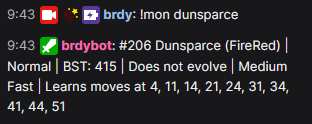
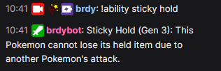

# brdybot
This is a bot adapted from [chatbot-python-sample](https://github.com/twitchdev/chatbot-python-sample) that I use for my Twitch channel, [twitch.tv/brdy](https://www.twitch.tv/brdy).

The bot uses a PostgreSQL database with data scraped and taken from [Serebii.net](https://www.serebii.net), [Bulbapedia](https://bulbapedia.bulbagarden.net/wiki/Main_Page), [veekun's Pokedex](https://github.com/veekun/pokedex), [Smogon University](https://www.smogon.com), and [pokemondb.net](https://pokemondb.net/).

If you would like the bot to join your channel, type "!join" into the [bot's channel here](https://www.twitch.tv/brdybot).

If you believe the bot has encountered an error, you can contact me on [Discord](https://discord.gg/33eQn3fK)

# Bot
The bot has the following commands available:
- !game <game abbreviation>: Sets the game and generation using an abbreviation code.
  
  
 
  
- !move <move name>: Looks up a move name and returns all generation-specific information about the move in the chat (name, pp, power, accuracy, category, contact/no contact, summary of effects, etc.).
  
 
 
  
- !mon <pokemon name>: Looks up a pokemon and returns all game-specific information about the pokemon in the chat (dex, name, type, BST, xp yield, evolution(s), learnset).
  
 
  
  
- !nature <nature>: Looks up a nature name and returns the affected stats in the chat.
  
  
  
- !ability <ability name>: Looks up an ability and returns a generation-specific summary of the ability with a description of its effects in the chat.
  
  
  

# Data
The database is not available in this repo, but the credits are as follows:

XP Yield, Capture Rates, EV Yields: Bulbapedia
Gen 1-8 Move Data: Smogon
Gen 1-7 Pokemon Move Data: veekun
Gen 8 Pokemon Move Data: Serebii.net
Cross-Checking: pokemondb.net
