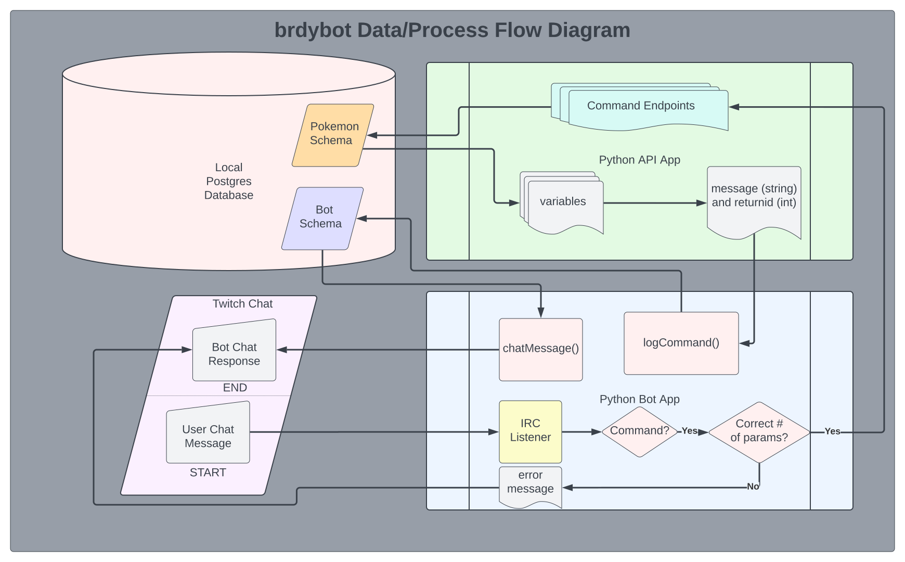
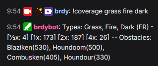
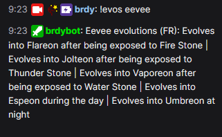

# brdybot
This is a bot adapted from [chatbot-python-sample](https://github.com/twitchdev/chatbot-python-sample) that I use for Twitch. The bot can be added to your Twitch channel by typing !join in the [bot's channel on Twitch](https://www.twitch.tv/popout/brdybot/chat).

The bot uses a PostgreSQL database with data scraped and taken from [Serebii.net](https://www.serebii.net), [Bulbapedia](https://bulbapedia.bulbagarden.net/wiki/Main_Page), [veekun's Pokedex](https://github.com/veekun/pokedex), [Smogon University](https://www.smogon.com), and [pokemondb.net](https://pokemondb.net/).

The IRC listener (chatbot) joins your channel, listens for and sends commands to the API to fetch data from the database, and prints the information gathered from the database in a channel message.

 

# Bot
The bot has the following commands available:

| Image | Command | Description | Type | Min Parameters | Max Parameters |
|:---------:|:---------:|:---------:|:---------:|:---------:|:---------:|
|abbrevs|Returns all available game abbreviations to the chat.|bot|0|0|
|ability|User sends an ability name as a parameter, and the bot returns information about it to the chat.|ability|1||
|basestats|User sends the name of a Pokemon, and the bot fetches and returns all of its vanilla base stats for the currently selected game.|pokemon|1||
|botinfo|The bot returns basic information and links related to the bot.|bot|0|0|
--|brdybotleave|Make the bot leave your channel (channel owner only).|bot|0|0|
|bst|User sends the name of a Pokemon as a parameter, and the bot returns the base stat total for that Pokemon for the current generation.|pokemon|1||
|coverage|Takes one or more types as inputs, and outputs the number of Pokemon in the current game that fall into each maximum damage effectiveness bracket.|type|1||
|coveragecomb|User sends a number between 2 and 4 (x) and a number of types at least 1 greater than x but no greater than 5. The bot will query the !coverage command for all the possible combinations of x types among the types given. Requires Mod or VIP priviliges to work effectively.|bot|4|6|
|evos|User sends the name of a pokemon as a parameter, and the bot returns all evolutions for that pokemon available in the currently selected game.|pokemon|1||
|gamelist|Lists the games available to be changed to with the !pokegame command.|bot|0|0|
|help|User sends the name of a command, and the bot returns the description of that command to chat.|commandselect|0|0|
--|join|Any user may type this in the bot's channel to have it join their channel.|bot|0|0|
|learnset|User sends the name of a Pokemon as a parameter, and the bot returns the levels at which that Pokemon learns moves in the current game.|pokemon|1||
|learnsetshort|User sends the name of a pokemon as a parameter, and the bot returns a list of levels at which it learns moves in the currently selected game.|pokemon|1||
|level|User sends three (3) parameters - the name of a growth rate (either Erratic, Fast, Medium Fast, Medium Slow, Slow, Fluctuating), a starting level, and an ending level. The bot will return the total required experience to go from the starting level to the ending level.|levelingrate|3|3|
|listops|Lists all operants for the current channel.|bot|0|0|
|lss|Alias for !learnsetshort: User sends the name of a pokemon as a parameter, and the bot returns a list of levels at which it learns moves in the currently selected game.|pokemon|1||
|mon|User sends a Pokemon name as a parameter, and the bot returns summary information about it to the chat.|pokemon|1||
|move|User sends a move name as a parameter, and the bot returns information about it to the chat.|move|1||
|nature|User sends a nature name as a parameter, and the bot returns the affected attributes to the chat.|nature|1||
|pokecom|The bot retrieves and returns all pokemon commands available.|commandselect|0|0|
|pokegame|User sends a game name or abbreviation as a parameter, and the bot changes the game for the channel.|game|1||
|pokeops|Send a list of usernames separated by a single space to add as bot operators in your channel. ex: "!pokeops juicytoaster bayleef murkus iateyourpie"|bot|1|20|
|removeops|Takes one or more usernames and removes permissions for them in the channel.|bot|1||
|revo|User sends the name of a Pokemon, and the bot fetches and returns a list of Pokemon and the percentage chance it will evolve into each using the following Ajarmar's Universal Pokemon Randomizer options: Random, Similar Strength, Same Typing, Force Change, Change Impossible Evolutions, Remove Time-Based Evolutions. Big shoutouts to Harkenn_ on twitch for the data. (Currently gen 3 only.)|pokemon|1||
|type|User sends the name of a Pokemon as a parameter, and the bot returns the type for the Pokemon in the current generation.|pokemon|1||
|weak|User sends a Pokemon name as a parameter, and the bot returns type effectiveness information about it to the chat.|pokemon|1||
|xp|User sends a pokemon's level, optionally the winning pokemon's level, and the name of the Pokemon. The bot will return the full xp value from fainting that pokemon in battle.|pokemon|2|3|
